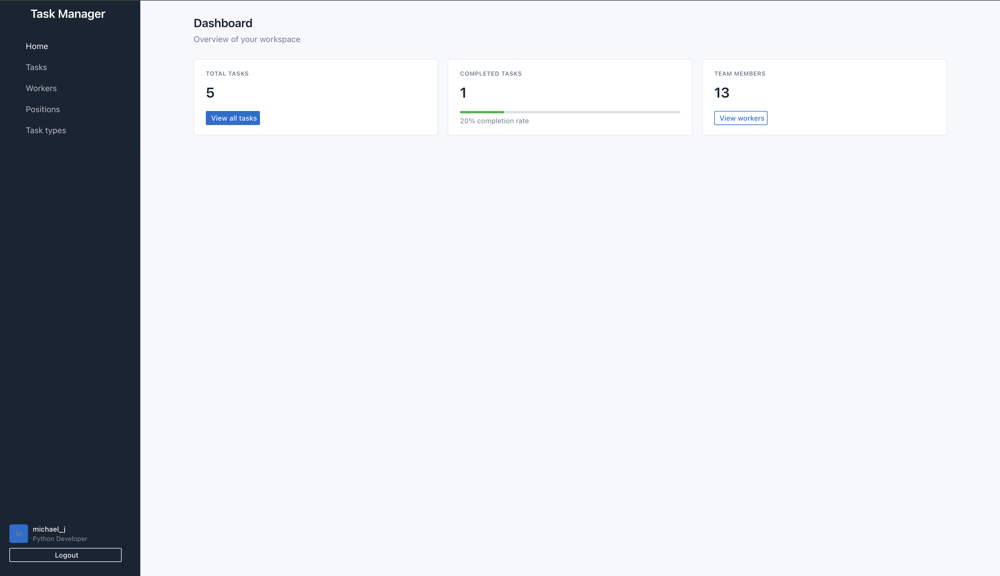

# task-manager

Project for managing your tasks

## Check it out!

Task Manager project deployed on Render: (https://task-manager-cz5i.onrender.com)

### Feel free to use it for testing!

````
* login: andrea_d
* password: dolan123
````

## Installation

Python3 must be already installed

``` shell
git clone https://github.com/lubkoserhii/task-manager
python3 -m venv venv
source venv/bin/activate
pip install -r requirements.txt
python manage.py runserver  # starts Django Server
```

### Features

* Authentication functionality for workers
* CRUD functionality for tasks
* Task status tracking
* Task priority
* Task due date
* Task description
* Search functionality
* Powerful admin panel


### Demo


